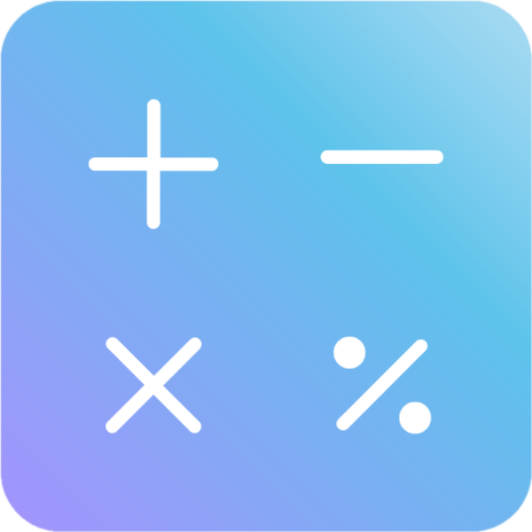

#      Calculadora

## Telas do aplicativo
  

## Sobre este projeto

Essa calculadora é o primeiro app que produzo. Ela foi feita na plataforma [MIT App Inventor](https://appinventor.mit.edu/) com a intenção de ter um primeiro contato com a elaboração de aplicativos, aprimorando meus conhecimentos e minhas habilidades.

Nessa calculadora se opera funcionalidades básicas de uma calculadora (adição, subtração, multiplicação e divisão). Além de possuir uma tela instruindo como que o usuário deve utilizá-la e um menu.

## Instalação

- [Clique aqui](https://drive.google.com/file/d/1xRC48C0lhjgRGUVMWUawkoleBihGIwbf/view?usp=sharing) para baixar o arquivo .apk Androide;
- [Clique aqui](https://drive.google.com/file/d/1CeWX3Mjj83c7mVZ4A7iKGQlJcjfb6-qV/view?usp=sharing) para baixar o arquivo .aab Androide.

### Modo Desenvolvimento

Caso queria entrar no modo desenvolvimento [clique aqui](http://ai2.appinventor.mit.edu/?ng=183613ef-a407-4f0a-878e-9a181858947d). Você será redirecionado para o site do MIT App Inventor, onde a aplicação foi produzida com a programação em blocos.

 **Observações**

- Caso não tenha uma conta no site MIT App Inventor, é possível que não consiga entrar no modo desenvolvimento do aplicativo.

## Professor Orientador 
- [Ilo Riveiro](https://github.com/ilorivero)